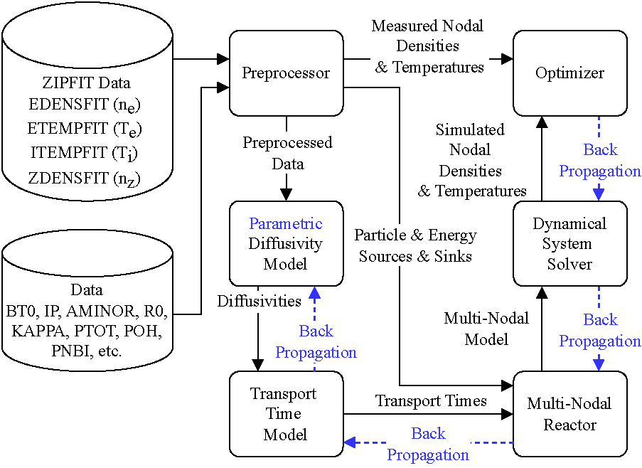

# \[ICLR 2024 AI4DiffEqtnsInSci\] NeuralPlasmaODE: Application of Neural Ordinary Differential Equations for Tokamak Plasma Dynamics Analysis

Welcome to our project on using neural ordinary differential equations (Neural ODEs) for modeling tokamak plasma dynamics! This work was accepted as a [poster](poster/plasma_poster.pdf) at the [ICLR 2024 Workshop on AI4DifferentialEquations in Science](https://ai4diffeqtnsinsci.github.io/). You can find our papers on arXiv ([DIII-D paper](https://arxiv.org/abs/2403.01635) and [ITER paper](https://arxiv.org/abs/2408.14404)).

<div align="center">
  
</div>

## Introduction

This study employs neural ordinary differential equations (Neural ODEs) to model energy transfer in tokamaks. By deriving diffusivity parameters from DIII-D tokamak data, the model accurately captures energy interactions between electrons and ions across core, edge, and scrape-off layers. Validated against various heating conditions, this approach demonstrates the potential of Neural ODEs to enhance tokamak simulation performance through deep learning.

## Usage

1. Clone the repository:
   ```bash
    git clone https://github.com/zefang-liu/NeuralPlasmaODE.git
    cd NeuralPlasmaODE
   ```
2. Install dependencies:
   ```bash
   pip install -r requirements.txt
   ```

3. Run the experiment:
   ```bash
   python main.py
   ```

## Citation

If you find this work useful, please consider citing our work as:

```bibtex
@article{liu2024application,
  title={Application of Neural Ordinary Differential Equations for Tokamak Plasma Dynamics Analysis},
  author={Liu, Zefang and Stacey, Weston M},
  journal={arXiv preprint arXiv:2403.01635},
  year={2024}
}

@article{liu2024application2,
  title={Application of Neural Ordinary Differential Equations for ITER Burning Plasma Dynamics},
  author={Liu, Zefang and Stacey, Weston M},
  journal={arXiv preprint arXiv:2408.14404},
  year={2024}
}
```

## License

This project is licensed under the Apache-2.0 License. See the [LICENSE](LICENSE) file for details.
